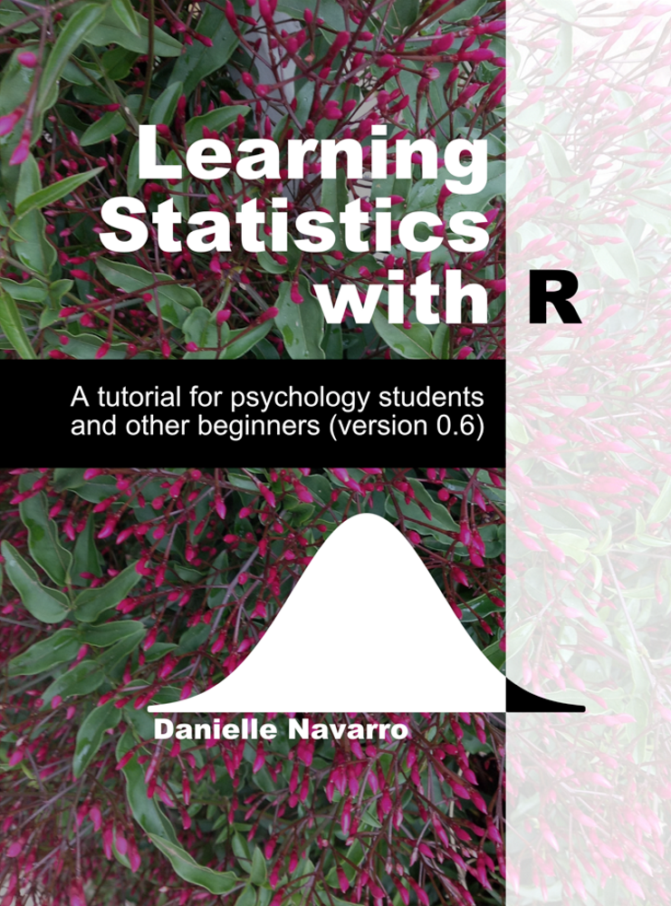

```{r setup, include = FALSE}
# remotes::install_github("gadenbuie/countdown")
# remotes::install_github("mitchelloharawild/icon")
# icons::download_fontawesome()
library(knitr)
library(tidyverse)
library(countdown)

opts_chunk$set(digits = 3)

# This style was adapted from Max Kuhn: https://github.com/rstudio-conf-2020/applied-ml
# And Rstudio::conf 2020: https://github.com/rstudio-conf-2020/slide-templates/tree/master/xaringan
# This slide deck shows a lot of the features of Xaringan: https://www.kirenz.com/slides/xaringan-demo-slides.html

# To use, add this to the slide title:   `r I(hexes(c("DATA606")))`
# It will use images in the images/hex_stickers directory (i.e. the filename is the paramter)
hexes <- function(x) {
  x <- rev(sort(x))
  markup <- function(pkg) glue::glue('')
  res <- purrr::map_chr(x, markup)
  paste0(res, collapse = "")
}
```


class: hide-logo, bottom, right, title-slide
background-image: url(images/Greetings_from_Statistics.jpeg)
background-size: contain

.font70[

[@skyetetra](https://twitter.com/ChelseaParlett/status/1340463322118856705)

]

---
# Agenda

* About your instructors
* Syllabus
* Class meetups
* Course Schedule
* Assignments (how you will be graded)
	* Participation
	* Homework
	* Labs
	* Data Project
	* Final exam
* Software
	* The `DATA606` R Package
	* Using R Markdown

---

# Introduction

A little about Jason:

* Assistant Professor at CUNY in Data Science and Information Systems
* Principal Investigator for a Department of Education Grant (part of their FIPSE First in the World program) to develop a Diagnostic Assessment and Achievement of College Skills ([www.DAACS.net](http://www.daacs.net))  
* Authored over a dozen R packages including:
	* [likert](http://github.com/jbryer/likert)
	* [sqlutils](http://github.com/jbryer/sqlutils)
	* [timeline](http://github.com/jbryer/timeline)
* Specialize in propensity score methods. Three new methods/R packages developed include:
	* [multilevelPSA](http://github.com/jbryer/multilevelPSA)
	* [TriMatch](http://github.com/jbryer/TriMatch)
	* [PSAboot](http://github.com/jbryer/PSAboot)
* Developer of a data dashboard for the NYS Office of Special Education and TAP for Data at Cornell University: https://data.osepartnership.org

---

# Also a Father...

```{r, out.width='65%', fig.align='center', echo=FALSE}
knitr::include_graphics('images/BoysFall2019.jpg')
```

---

# Runner...

<table border='0' width='100%'><tr><td>
<center></center>
</td><td>
<center></center>
</td></tr></table>

---

# And photographer.

```{r, out.width='80%', fig.align='center', echo=FALSE}
knitr::include_graphics('images/Sleeping_Empire.jpg')
```

---

# Introduction

A little about Angela...


---

# Syllabus `r hexes(c('blogdown', 'rmarkdown'))`

Syllabus and course materials are here: [https://fall2021.data606.net](https://fall2021.data606.net)

The site is built using the [Blogdown](https://bookdown.org/yihui/blogdown/) R package and hosted on [Github](https://github.com/jbryer/DATA606Fall2021). Each page of the site has a "Improve this page" link at the bottom right, use that to start a pull request on Github.

We will use Blackboard primary for submitting assignments only. Please submit:

* A PDF or link to the built HTML (e.g. Rpubs, [Github](http://htmlpreview.github.io/))

PDFs are preferred for the homework as there is some LaTeX formatting in the R markdown files. The `tineytex` R package helps with install LaTeX, but you can also install LaTeX using [MiKTeX](http://miktex.org) (for Windows) and [BasicTeX](http://www.tug.org/mactex/morepackages.html) (for Mac) See this page for more information: 
https://fall2021.data606.net/course-overview/software/

---
class: font90

# Meetups

We will have meetups on Wednesday evenings at 8:30pm. 

Meetups will be recorded and made available the next day on the [course website](https://fall2021.data606.net/course-overview/meetups/).

Though attending live is not strictly required, **We expect everyone to watch the lectures during the week.** I use the class meetups to convey important information and announcements. Very often I will cover some topics not in the textbook. Students who attend the meetups tend to do well on the assignments.

**One Minute Papers** - Complete the one minute paper after each Meetup (whether you watch live or watch the recordings). It should take approximately one to two minutes to complete. This allows me to 1) verify you have attended/watch the meetup and 2) get feedback about what you learned and what you may still be unclear.  
Link: https://forms.gle/QWb3Fh6MgG4CpB3Y9

.font60[

**Please note:** *Students who participate in this class with their camera on or use a profile image are agreeing to have their video or image recorded solely for the purpose of creating a record for students enrolled in the class to refer to, including those enrolled students who are unable to attend live.  If you are unwilling to consent to have your profile or video image recorded, be sure to keep your camera off and do not use a profile image. Likewise, students who un-mute during class and participate orally are agreeing to have their voices recorded.  If you are not willing to consent to have your voice recorded during class, you will need to keep your mute button activated and communicate exclusively using the "chat" feature, which allows students to type questions and comments live.*

]

---

# Schedule

```{r schedule-setup, echo=FALSE, warning=FALSE, message=FALSE}
# devtools::install_github("gadenbuie/ggweekly")
library(ggweekly)
library(rlang) # Needed for the ggweekly.R script to work
library(configr)
library(ggplot2)
library(readxl)
library(lubridate)
# library(kableExtra)

options(knitr.kable.NA = '')

semester <- 'Spring 2021'

palette <- c('#8dd3c7','#ffffb3','#bebada','#fb8072','#80b1d3','#fdb462',
			 '#b3de69','#fccde5','#d9d9d9','#bc80bd','#ccebc5','#ffed6f')

lastModified <- format(file.info('../Schedule.xlsx')[1,]$mtime, '%B %d, %Y %I:%M%p')

meetups <- read_excel('../Schedule.xlsx', sheet = 'Meetups')
meetups$day <- as.Date(meetups$Date)
meetups$label <- paste0('Meetup ', meetups$StartTime, '\n', meetups$Topic)
# meetups$label <- meetups$Topic
meetups$color <- '#4A235A'
meetups$fill <- NA

officeHours <- read_excel('../Schedule.xlsx', sheet = 'Office_Hours')
officeHours$day <- as.Date(officeHours$Date)
officeHours$label <- paste0('Office Hours\n', officeHours$StartTime, '')
officeHours$color <- '#145A32'
officeHours$fill <- NA

schedule <- rbind(meetups[,c('day', 'label', 'color', 'fill')],
				  officeHours[,c('day', 'label', 'color', 'fill')])

topics <- read_excel('../Schedule.xlsx', sheet = 'Schedule')
topics$Start <- as.Date(topics$Start)
topics$End <- as.Date(topics$End)
for(i in 1:nrow(topics)) {
	schedule <- rbind(schedule, data.frame(
		day = topics[i,]$Start,
		label = paste0(topics[i,]$Topic, '\n\n\n'),
		color = '#000000',
		fill = palette[i]
	))
	dates <- seq(topics[i,]$Start, topics[i,]$End, by = 'day')[-1]
	for(j in seq_along(dates)) {
		schedule <- rbind(schedule, data.frame(
			day = dates[j],
			label = NA,
			color = NA,
			fill = palette[i]
		))
	}
}

start_day <- lubridate::floor_date(min(meetups$day), "month")
end_day <- lubridate::ceiling_date(max(meetups$day), "month") - 1
```

```{r printTopics, echo=FALSE, warning=FALSE, message=FALSE, results='asis'}
topics$Start <- format(topics$Start, format = '%A, %B %d, %Y')
topics$End <- format(topics$End, format = '%A, %B %d, %Y')
topics <- topics %>% filter(!is.na(Link)) %>% select(-Link)
knitr::kable(topics, format = 'html')
```

---

# Textbooks `r hexes(c('openintro'))`

.pull-left[

Diez, D.M., Barr, C.D., & Çetinkaya-Rundel, M. (2019). *OpenIntro Statistics (4th Ed)*.

.font70[

This will be our primary textbook for most of the semesters. Our goal is to cover all the chapters.


]

.center[

<a href = "https://github.com/jbryer/DATA606fall2021/blob/master/Resources/Textbooks/os4.pdf"></a>

]

]

.pull-right[

Navarro, D. (2018, version 0.6). *Learning Statistics with R*

.font70[

This textbooks has a chapter on Bayesian analysis that we will use at the end of the semester. 

]

.center[

<a href = "https://github.com/jbryer/DATA606fall2021/blob/master/Resources/Textbooks/lsr-0.6.pdf"></a>

]

]

---

# Assignments

* [DAACS](https://fall2021.data606.net/assignments/daacs) (6%)
* [Participation](https://fall2021.data606.net/assignments/participation) (10%)
  * One Minute Papers
  * Meetup Presentation - Present one practice problem during our weekly meetups. Signup using the [Google Spreadsheet](https://fall2021.data606.net/course-overview/meetups). **Please select odd number questions only!**
* [Homework](https://fall2021.data606.net/assignments/homework) (18%)
* [Labs](https://fall2021.data606.net/assignments/labs) (36%)
	* Labs are designed to introduce to you doing statistics with R.
	* Answer the questions in the main text as well as the "On Your Own" section.
* [Data Project](https://fall2021.data606.net/assignments/project) (20%)
	* This allows you to analyze a dataset of your choosing. Projects will be shared with the class. This provides an opportunity for everyone to see different approaches to analyzing different datasets.
* [Final exam](https://fall2021.data606.net/assignments/final/) (10%)

---

# Communication

* Slack Channel: https://data606fall2021.slack.com
	* [Click here to join the group]()
* There is a general CUNY MSDS Slack channel [click here](https://join.slack.com/t/data606fall2021/shared_invite/zt-tqeu5u6e-qIimBoChX2oyvCJLovewWg) to join it.
* Github Issues - Use this for issues or problems with the course or `DATA606` package: https://github.com/jbryer/DATA606Fall2021/issues
* Email: [jason.bryer@cuny.edu](mailto:jason.bryer@cuny.edu) and [angela.lui@sps.cuny.edu](mailto:angela.lui@sps.cuny.edu)
* Phone/Zoom: Please email to schedule a time to meet.
* Office hours by appointment.

---

# Software `r hexes(c('rmarkdown', 'RStudio', 'tinytex'))`

This is an applied statistics course so we will make extensive use of the [R statistical programming language](https://www.r-project.org). You have two options for using R in this course:

* CUNY SPS has an RStudio Server that you can access using a browser: https://rstudio.sps.cuny.edu  
  You will use your CUNY login credentials to log in.

* Install [R](https://cran.r-project.org) and [RStudio](https://rstudio.com) on your own computer. I encourage everyone to do this at some point by the end of the semester. I have instructions on the course website here: https://fall2021.data606.net/course-overview/software/

You will also need to have [LaTeX](https://www.latex-project.org) installed as well in order to create PDFs. The [`tinytex`](https://yihui.org/tinytex/) R package helps with this process:

```
install.packages('tinytex')
tinytex::install_tinytex()
```

---

# DATA 606 Package `r hexes(c('devtools', 'rmarkdown'))`

The [`DATA606`](https://github.com/jbryer/DATA606) R package contains many data sets and functions we will use throughout the semester. It also has a `startLab` function that will copy each of the labs to your current working directory. Use the following commands to install the package (only necessary once per R installation):

```
remotes::install_github('jbryer/DATA606')
```

To start the first lab...

```
DATA606::startLab('Lab1')
```

This will copy the R markdown file and any supporting files to your current working directory. Use the "Knit" button in R Studio to build a PDF of the document.

---
# Next steps... `r hexes(c('DAACS'))`

Before Monday (August 30th):

* Complete this Google form: https://forms.gle/FGsUWy61k8A3ujYH9
* Create an account at https://my.daacs.net and complete the self-regulated learning assessment
* [Join the Slack channel](https://join.slack.com/t/bryer/shared_invite/zt-kdk4bypz-x5zJS0oTypT3TEPilfy~IA)

Then:

* Start Lab 1 (due September 5th)
* Start Homework 1 (due September 5th)

---
class: inverse, right, middle, hide-logo

<!--img src="images/hex/DATA606.png" width="150px"/-->

# Good luck with the semester!

[`r icons::fontawesome("paper-plane")` jason.bryer@cuny.edu](mailto:jason.bryer@cuny.edu)  
[`r icons::fontawesome("paper-plane")` angela.lui@sps.cuny.edu](mailto:angela.lui@sps.cuny.edu)  
[`r icons::fontawesome("slack")` data606fall2021.slack.com](https://data606fall2021.slack.com)  
[`r icons::fontawesome("github")` @jbryer](https://github.com/jbryer)  
[`r icons::fontawesome("github")` @angelalui11](https://github.com/angelalui11)  
[`r icons::fontawesome("twitter")` @jbryer](https://twitter.com/jbryer)  
[`r icons::fontawesome("link")` fall2021.data606.net](https://fall2021.data606.net)   


