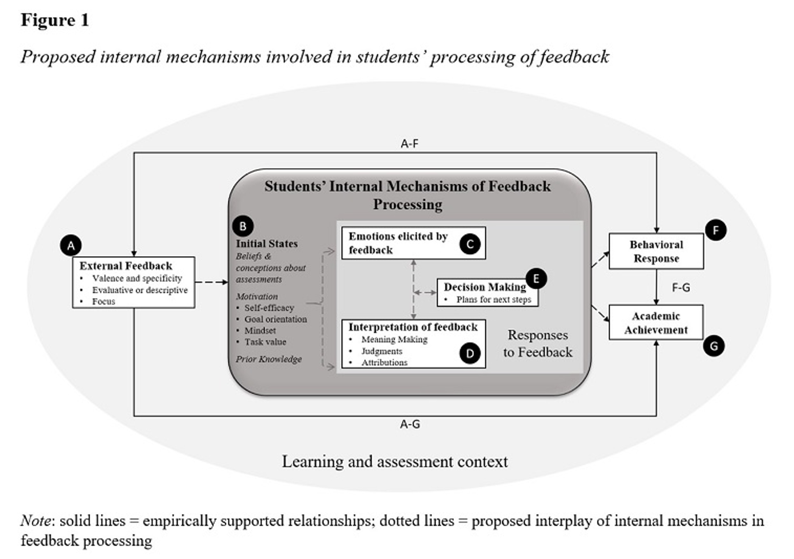

```{r setup, include = FALSE}
# remotes::install_github("gadenbuie/countdown")
# remotes::install_github("mitchelloharawild/icon")
# icon::download_fontawesome()
# devtools::install_github("thomasp85/patchwork")

library(knitr)
library(tidyverse)
library(countdown)
library(likert)
library(fontawesome)

opts_chunk$set(digits = 3)

# This style was adapted from Max Kuhn: https://github.com/rstudio-conf-2020/applied-ml
# And Rstudio::conf 2020: https://github.com/rstudio-conf-2020/slide-templates/tree/master/xaringan
# This slide deck shows a lot of the features of Xaringan: https://www.kirenz.com/slides/xaringan-demo-slides.html

# To use, add this to the slide title:   `r I(hexes(c("DATA606")))`
# It will use images in the images/hex_stickers directory (i.e. the filename is the paramter)
hexes <- function(x) {
  x <- rev(sort(x))
  markup <- function(pkg) glue::glue('')
  res <- purrr::map_chr(x, markup)
  paste0(res, collapse = "")
}
```


# Final Exam

* Is now available on Blackboard.

* Due by end of day December 12th

* You may use your book and course materials.

* We expect you to complete the exam on your own (i.e. do not discuss with classmates, colleagues, significant others, etc.)

* There are two parts:
	1. Part one multiple choice questions and short answer questions.
	2. Part two has a small data set to analyze with R, then answer some interpretation questions.

* Put your answers in the Rmarkdown file and submit the PDF file. **Please do not post your answers online!**


---
# Presentations

*  Nnaemeka Okereafor

---
# Jason's Work

My statistical research interest is in propensity score methods. Propensity score analysis (PSA) is a quasi-experimental design used to estimate causality from observational studies. It is generally conducted in two phases:

1. Estimate propensity scores (i.e. probability of being in the treatment) using the observed covariates.
	a. Check balance
	b. Re-estimate propensity scores
2. Estimate effect sizes using typical group differences (e.g. t-tests)

See my [Github repository](https://github.com/jbryer/psa) or [Intro to PSA slides](http://epsy887.bryer.org/slides/Intro_PSA.html). Also the PSA Shiny application:

```{r, eval=FALSE}
psa::psa_shiny()
```

Areas I have worked on:

* Multilevel PSA (see [`multilevelPSA`](http://jason.bryer.org/multilevelPSA) R package)
* Matching with non-binary treatments (see [`TriMatch`](http://jason.bryer.org/TriMatch) R package)
* Bootstrapping PSA (see [`PSAboot`](http://jason.bryer.org/PSAboot) R package)

---
# DAACS

[The Diagnostic Assessment and Achievement of College Skills](https://daacs.net) (DAACS) is a suite of technological and social supports to optimize student learning. DAACS  provides personalized feedback about students’ strengths and weaknesses in  terms of key academic and self-regulated learning skills, linking them to the resources to help them be successful students.

Applications of Data Science:

* We use natural language processing and predictive models to machine score the essays.
* We use DAACS data to estimate "risk scores" for students failing so we can target them with resources to help them be successful.

Received a $3.8 million grant this year from the Institute of Education Sciences to test the efficacy at three institutions.


---
# Students’ responses to feedback

.center[
```{r, echo=FALSE, out.width=800}

```
]

---
# Exploring Responses to Feedback in DAACS

**Some Research Questions**

1. What are the sentiments conveyed in students’ essays?
2. What judgments about SRL feedback emerge in students’ essays?
3. What meanings do students make of the SRL feedback? (a focus on the content criterion?)
4. What attributions do students make if any?
5. To what strategies do students tend to commit? 
6. Are these (above five bullets) related to 1) the number of dots they received per domain? 2) the number of feedback pages they viewed? 3) the level of feedback specificity they viewed? 

**Data Sources**

* Students’ essays on the DAACS Writing Assessment
* Students’ SRL Assessment Results and Feedback

**Analyses**

* Sentiment Analysis
* Content Analysis


---
# Thank You

This has been a great semester. Please don't hesitate to reach out:

.pull-left[
`r fa('envelope')` Email: [jason.bryer@cuny.edu](mailto:jason.bryer@cuny.edu)
`r fa('github')` Github: https://github.com/jbryer
`r fa('link')` Personal Website: https://bryer.org
`r fa('linkedin')` [LinkedIn](https://www.linkedin.com/in/jasonbryer/)
`r fa('twitter')` Twitter: [jbryer](https://twitter.com/jbryer)

]
.pull-right[
`r fa('envelope')` Email: [angela.lui@cuny.edu](mailto:angela.lui@cuny.edu)
`r fa('linkedin')` [LinkedIn](https://www.linkedin.com/in/angela-m-lui-8b051928/)
]
<br/>

You can download all course materials on [Github](https://github.com/jbryer/DATA606Fall2021). Click the [clone or download](https://github.com/jbryer/DATA606Fall2021/archive/master.zip) link to download a zip file.

